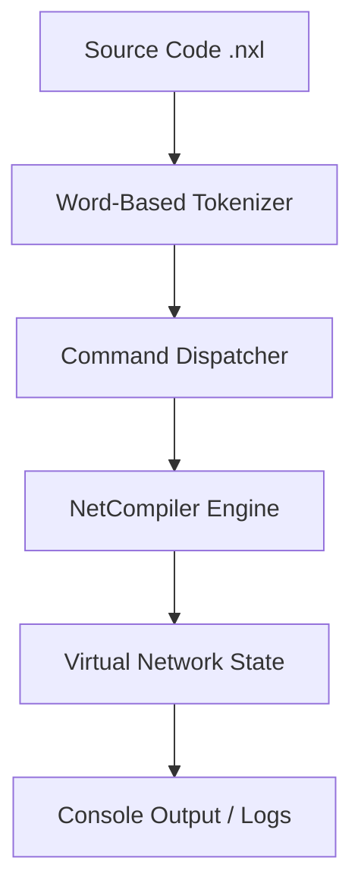

# Project Report: NetXLang Compiler Implementation

**Subject**: CSE-422: Compiler Design / Final Year Project  
**Student Name**: Sabikun Nahar Alina  
**Student ID**: 1016  
**Batch**: CSE 54  
**Department**: Computer Science and Engineering  
**University**: University of Information Technology and Sciences (UITS)

---

## 1. Abstract
NetXLang is a domain-specific language (DSL) designed to simulate basic network behavior with Bengali-inspired commands. The project uses a C++17 interpreter model in a single source file. NetXLang lets users create virtual devices, send packets, apply simple security rules, and observe output logs.

## 2. Introduction
### 2.1 Motivation
Networking concepts are often difficult due to the complexity of existing simulation tools. NetXLang aims to lower the barrier to entry by providing a human-readable, semantic language that uses familiar Bengali-rooted terms to describe complex technical operations.

### 2.2 Objectives
- To design a lightweight, cross-platform networking DSL.
- To implement a simple interpreter model.
- To simulate real-world networking behaviors like packet loss, latency, and encryption.
- To provide a functional tool for academic learning in networking and compiler design.

## 3. System Architecture
The NetXLang compiler uses a small interpreter pipeline that is easy to follow in class or lab work.

### 3.1 Compiler Components
1. **Word-Based Tokenizer**: Splits source code into words and keeps quoted strings together.
2. **Command Dispatcher**: Reads command tokens and calls the matching C++ function.
3. **Network State Engine**: Stores device state (IP, port, queue, protocol, neighbors, rules).

## 4. Language Design & Grammar
NetXLang uses an imperative, block-structured grammar.

### 4.1 Implementation Model
Instead of a full multi-pass compiler, NetXLang uses a direct-execution interpreter model. This keeps the implementation small and easier to understand.

### 4.3 Command Table

| # | NetXLang Function | Networking Concept | Technical Working |
|---|-------------------|-------------------|-------------------|
| 1 | `NetArambho` | Session Start | Initializes the interpreter and simulation environment. |
| 2 | `NetShesh` | Session End | Safely terminates the simulation and prints final logs. |
| 3 | `JontraGothon` | Device Creation | Allocates a new virtual node (Router, Host, Server) in memory. |
| 4 | `JogajogSet` | Physical Link | Establishes a bidirectional adjacency between two virtual nodes. |
| 5 | `ThikanaDao` | IP Assignment | Assigns a unique IPv4 address to a specific virtual node. |
| 6 | `DorjaDao` | Port Assignment | Assigns a listening network port to a virtual node. |
| 7 | `PacketPathao` | Data Transmission | Routes a packet from source to destination via the link layer. |
| 8 | `PacketNey` | Packet Processing | Pops the first packet from a device's queue and processes it. |
| 9 | `ShobaiPathao` | Broadcast | Floods a packet to all immediate neighbors of the source. |
| 10 | `PothNirdharon` | Static Routing | Adds an entry to the virtual routing table for path optimization. |
| 11 | `JachaiPing` | ICMP Echo | Verifies reachability between two nodes in the topology. |
| 12 | `Bilombho` | Latency Simulation | Blocks execution for N milliseconds to simulate network lag. |
| 13 | `HariyeFelo` | Packet Loss | Sets a percentage-based drop rate on a specific node. |
| 14 | `GotiNiyontron` | QoS / Bandwidth | Implements a simulated bitrate limit on a virtual device. |
| 15 | `NiyomBoshao` | Protocol Selection | Sets the active protocol layer (HTTP, HTTPS, FTP) for a node. |
| 16 | `ProtirodhDao` | Firewall Rule | Blacklists an IP address to block incoming traffic at the node. |
| 17 | `NirikhaKoro` | State Monitoring | Dumps the internal state (IP, Queue, Protocol) of a device. |
| 18 | `GhotonaLekho` | Event Logging | Prints a log-style message to the console. |
| 19 | `Dekhao` | Output Stream | Standard output for printing expressions or variable results. |
| 20 | `Jodi` | Conditional (If) | Executes a block if the target device exists or condition is met. |
| 21 | `Nahole` | Conditional (Else) | Executes an alternative block if the `Jodi` condition fails. |
| 22 | `GhuroChol` | Iteration (Loop) | Repeats a sequence of network operations N times. |
| 23 | `KajGothon` | Encapsulation | Defines a reusable procedure (function) for complex tasks. |
| 24 | `GoponKoro` | Encryption | Transforms plaintext using a Caesar-shift based cipher. |
| 25 | `UghatKoro` | Decryption | Reverses the encryption transformation to retrieve plaintext. |

## 5. Implementation Details
### 5.1 The Simulation Engine
The core of NetXLang is the `NetCompiler` struct, which maintains a device map for the virtual network. Each `Device` stores:
- IP Address, Port, and Protocol.
- Packet Queue (FIFO).
- Routing Table and Rate Limits.
- Security Rules (Blocked IPs).

### 5.2 Simulation Features
- **Encryption**: Implemented using a custom byte-shift algorithm.
- **Packet Loss**: A randomized probability check applied during transmission.
- **Flow Control**: Support for loops (`GhuroChol`) and conditional execution (`Jodi`).

## 6. Testing and Results
### 6.1 Test Scenario: Enterprise Audit
A test script was executed to simulate an enterprise security audit.
**Key Results**:
- Successfully blocked unauthorized Guest access via `ProtirodhDao`.
- Successfully transmitted encrypted Admin credentials via `GoponKoro`.
- Verified 100% connectivity for authorized paths.

The output matched expected simulation behavior for the networking DSL interpreter.

## 7. Conclusion
The NetXLang project shows how a small domain-specific language can simplify networking concepts. By combining Bengali-inspired commands with a clean C++ interpreter, the project works well as an educational compiler design submission.

## 8. References
1.  Aho, A. V., Lam, M. S., Sethi, R., & Ullman, J. D. (2006). *Compilers: Principles, Techniques, and Tools*.
2.  Tanenbaum, A. S., & Wetherall, D. J. (2011). *Computer Networks*.
