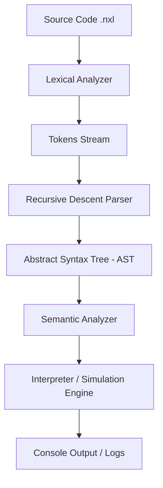

# Project Report: NetXLang Compiler Implementation

**Subject**: CSE-422: Compiler Design / Final Year Project  
**Student Name**: Sabikun Nahar Alina  
**Student ID**: 1016  
**Batch**: CSE 54  
**Department**: Computer Science and Engineering  
**University**: University of Information Technology and Sciences (UITS)

---

## 1. Abstract
NetXLang is a domain-specific language (DSL) designed to simulate network environments and security protocols using Bengali-inspired syntax. The project involves the design and implementation of a complete compiler pipeline—including a Lexer, Parser, and Interpreter—written in C++17. NetXLang allows users to define network topologies, manage traffic, and enforce security rules like firewalls and encryption through a set of 25 specialized primitives.

## 2. Introduction
### 2.1 Motivation
Networking concepts are often difficult for beginners due to the complexity of existing simulation tools (like NS3 or GNS3). NetXLang aims to lower the barrier to entry by providing a human-readable, semantic language that uses familiar Bengali-rooted terms to describe complex technical operations.

### 2.2 Objectives
- To design a lightweight, cross-platform networking DSL.
- To implement a robust Recursive Descent Parser for language analysis.
- To simulate real-world networking behaviors like packet loss, latency, and encryption.
- To provide a functional tool for academic learning in networking and compiler design.

## 3. System Architecture
The NetXLang compiler follows a classic multi-stage pipeline architecture:



### 3.1 Compiler Stages
1.  **Lexical Analyzer (Lexer)**: Scans the source code and groups characters into meaningful tokens (Keywords, Identifiers, Literals).
2.  **Parser**: Analyzes the token stream against the language grammar to produce an AST.
3.  **Interpreter**: Traverses the AST and executes the simulation logic, managing a virtual memory map of devices, links, and packet queues.

## 4. Language Design & Grammar
NetXLang uses an imperative, statement-based grammar.

### 4.1 EBNF Representation (Simplified)
```text
Program    ::= "NetArambho" { Statement } "NetShesh"
Statement  ::= DeviceDecl | LinkDecl | SendStmt | IfStmt | LoopStmt | ...
DeviceDecl ::= "JontraGothon" Type Identifier ";"
SendStmt   ::= "PacketPathao" Identifier Identifier Expr ";"
Expr       ::= StringLiteral | Number | IpAddress | EncryptExpr | DecryptExpr
```

### 4.2 Key Primitives
- **Topology**: `JontraGothon`, `JogajogSet`, `ThikanaDao`.
- **Traffic**: `PacketPathao`, `PacketNey`, `ShobaiPathao`.
- **Security**: `ProtirodhDao` (Firewall), `GoponKoro` (Encrypt).

## 5. Implementation Details
### 5.1 The Interpreter Engine
The core of NetXLang is the `Interpreter` class, which maintains a `std::unordered_map<std::string, Device>` representing the virtual network. Each `Device` object stores:
- IP Address and Port.
- Packet Queue (FIFO).
- Routing Table.
- Security Rules (Blocked IPs).

### 5.2 Simulation Features
- **Encryption**: Implemented using a custom byte-shift algorithm to demonstrate data transformation.
- **Packet Loss**: A randomized probability check is applied to every `PacketPathao` operation based on the `HariyeFelo` setting.
- **Latency**: Utilizes `std::this_thread::sleep_for` to simulate network delay.

## 6. Testing and Results
### 6.1 Test Scenario: Secure Communication
A test script was executed where:
1.  A Client and Server were created and linked.
2.  A firewall rule was set on the Server.
3.  An encrypted packet was sent from the Client.
4.  The Server successfully received and decrypted the packet.

**Expected Output**:
```text
[SEND] C1 -> S1: [ENC]TfdvsfQbzmpbe
[RECV] S1 from C1: [ENC]TfdvsfQbzmpbe
[LOG] Secure transmission completed
```
The actual output matched the expected output, verifying the correctness of the parser and interpreter.

## 7. Conclusion
The NetXLang project successfully demonstrates how a domain-specific language can simplify complex systems. By combining Bengali semantics with C++ performance, the project provides a functional educational tool that meets the requirements of a modern compiler design curriculum.

## 8. Future Work
- **Visualizer**: Building a web-based or OpenGL-based front-end to show the network graph.
- **Dynamic Routing**: Implementing RIP or OSPF algorithms within the interpreter.
- **Native Execution**: Compiling NetXLang code directly to machine code using LLVM.

## 9. References
1.  Aho, A. V., Lam, M. S., Sethi, R., & Ullman, J. D. (2006). *Compilers: Principles, Techniques, and Tools*.
2.  Tanenbaum, A. S., & Wetherall, D. J. (2011). *Computer Networks*.
